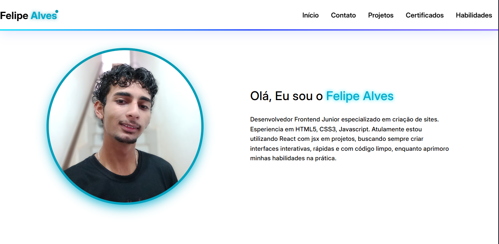
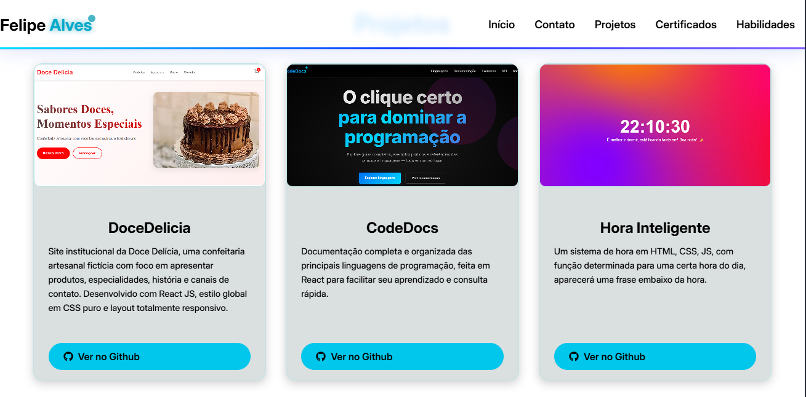

# 🚀 Felipe Alves - Portfólio Frontend

<p align="center">
  
</p>

> Portfólio profissional desenvolvido com React + Vite, apresentando projetos, habilidades e certificações de um desenvolvedor Frontend Junior.

[](https://github.com/felipe-allves/Portfolio/pulls)
[](https://app.netlify.com/projects/felipe-allves/deploys)

## ✨ Destaques

- **Design Moderno** - Interface limpa com gradientes e efeitos visuais
- **Performance Otimizada** - Construído com Vite para carregamento ultrarrápido
- **Componentização Eficiente** - Arquitetura React bem organizada
- **Interações Fluidas** - Animações e transições suaves

## 🛠️ Tecnologias Principais

- React JS (Hooks + Components)
- Vite (Frontend Tooling)
- CSS3 (Flexbox/Grid)
- JavaScript ES6+
- React Icons

## 🎯 Seções

1. **Hero** - Apresentação pessoal com foto e breve descrição
2. **Projetos** - Grid de cards com projetos destacados
3. **Certificados** - Galeria de certificações profissionais
4. **Conhecimentos** - Habilidades técnicas e ferramentas
5. **Contato** - Links para redes sociais e email

## 🚀 Como Executar

```bash
# Clone o repositório
git clone https://github.com/FelipeAlves/portfolio.git

# Instale as dependências
npm install

# Inicie o servidor de desenvolvimento
npm run dev

# Acesse no Navegador
https://localhost:5173
```

## 🎨 Design System

- **Cores Primárias:** - Azul ciano (#00e1ff) e Azul royal (#1a3aff)
- **Tipografia:** - Inter (Google Fonts)
- **Efeitos:** - Gradientes, blur e sombras
- **Componentes Reutilizáveis:** - Cards, botões, grids

## 📸 Preview

Confira abaixo algumas imagens da interface do projeto:
### 🏠 Header + Hero


### ☕ Projetos


## 🌐 Deploy

[](https://app.netlify.com/projects/felipe-allves/deploys)

🔗 **Acesse o site aqui:**  
👉 https://felipe-allves.netlify.app

---

Feito com ❤️ por **Felipe Alves** — Obrigado por visitar este projeto!

📧 ***Contato:*** [E-mail](felipealves1484@gmail.com)